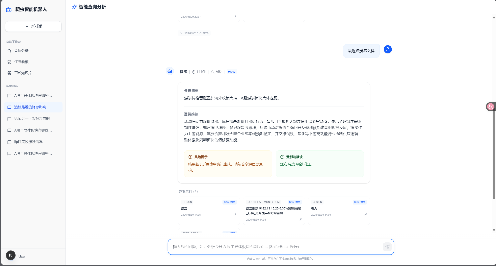

# 爬虫智能机器人 (AI Spider Bot) - 金融资讯 RAG 智能体



本项目是一个面向 **中国 A 股市场** 的专业金融资讯分析系统。它结合了大语言模型（LLM，通义千问 Qwen-Plus）与 RAG（检索增强生成）技术，实现了从“全行业资讯同步”到“精准意图分析”的全链路金融投研辅助。

---

## 🌟 项目亮点 (Project Highlights)

### 1. **工业级“反思校验 (Reflection)”机制**
- **拒绝幻觉**：系统不仅进行检索，还会对生成内容进行二次审查。通过 `_check_analysis_relevance` 逻辑，自动检测分析结论是否偏离了用户请求的板块。
- **精准拦截**：有效解决了传统 RAG 系统中常见的“问半导体匹配到猪肉”等语义偏差问题，确保金融分析的严肃性。

### 2. **金融级行业对齐：通达信 (TDX) 标准分类**
- **强意图约束**：系统内置 31 个通达信一级行业分类（如：金融、采掘、化工、电子、计算机等）。
- **行业标签化**：每一条入库资讯均经过 LLM 自动打标，确保在检索阶段实现严格的板块隔离。

### 3. **“离线同步 + 本地检索”高效架构**
- **按需同步**：用户可一键触发全行业或指定板块的资讯同步，彻底告别查询时的实时爬虫等待。
- **毫秒级响应**：基于本地向量库的 RAG 流程，极大提升了投研分析的交互体验。
- **自愈提示**：系统自动监控数据时效性，当资料缺失或过时时，主动提示用户进行同步。

### 4. **高价值信源权重优化**
- **财联社/见闻特供**：针对重大市场事件，系统会自动提升财联社电报等高价值、时效性强的信源权重，确保关键资讯不遗漏。

---

## 🛠️ 技术架构 (Tech Stack)

### **前端 (Frontend)**
- **框架**: Next.js 15 (App Router)
- **样式**: Tailwind CSS 4 + Lucide Icons
- **状态管理**: Zustand
- **请求**: Axios

### **后端 (Backend)**
- **框架**: FastAPI (Python 3.10+)
- **向量库**: FAISS (基于本地存储)
- **数据库**: MySQL (SQLAlchemy ORM)
- **LLM**: 通义千问 Qwen-Plus (DashScope API)
- **正文提取**: Jina Reader API

---

## 🚀 快速开始 (Quick Start)

### 1. 准备工作
- 确保已安装 MySQL 并创建数据库 `financial_agent_db`。
- 获取 [阿里云 DashScope API Key](https://dashscope.console.aliyun.com/)。

### 2. 启动后端
```bash
cd backend
# 建议使用虚拟环境
python -m venv venv
.\venv\Scripts\activate  # Windows
# 安装依赖
pip install -r requirements.txt
# 配置 .env (参考 core/config.py)
# 启动服务
python main.py
```

### 3. 启动前端
```bash
cd frontend
# 安装依赖
npm install
# 启动开发服务器
npm run dev
```

---

## 📁 目录结构 (Project Structure)
```text
/
├── backend/               # FastAPI 后端
│   ├── api/               # API 接口路由
│   ├── core/              # 数据库与全局配置
│   ├── models/            # 数据库模型 (MySQL)
│   ├── schemas/           # Pydantic 响应/请求模型
│   ├── services/          # 核心逻辑 (RAG, 意图解析, 同步服务)
│   └── main.py            # 入口文件
├── frontend/              # Next.js 前端
│   ├── src/app/           # 页面路由 (查询、同步、任务)
│   ├── src/components/    # 业务组件
│   └── src/lib/           # API 封装与状态管理
└── docs/                  # 设计文档与开发记录
```

---

## 📝 最近更新 (Recent Updates)
- [2026-03-30] 修复了 QueryIntent 的 Pydantic 验证报错，支持“降息”等宏观政策查询。
- [2026-03-29] 实现了全行业手动同步功能，切换为“离线检索+手动更新”模式以提升响应速度。
- [2026-03-28] 引入 Reflection 机制，严格过滤行业不匹配的检索结果。

---

## 🤝 贡献与反馈
项目地址: [lv163713/financial-ai-agent](https://github.com/lv163713/financial-ai-agent)
欢迎提交 Issue 或 Pull Request。

